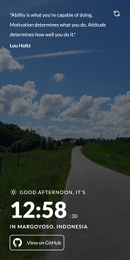

# Clock App

A clock app with random quotes, location info, & dynamic background based on the time of the day.

  

## Tech Stack
- React
- Next.js
- Tailwind

## Acknowledgments
- Design - [Clock App Challenge by Frontend Mentor](https://www.frontendmentor.io/challenges/clock-app-LMFaxFwrM)
- [Day image](https://unsplash.com/photos/dvACrXUExLs)
- [Afternoon image](https://unsplash.com/photos/EHpOfsf8bgo)
- [Evening image](https://unsplash.com/photos/Jztmx9yqjBw)
- [Random Quote API](https://github.com/lukePeavey/quotable)
- [IP Geolocation API - IPWhois](https://ipwhois.io/)
- [World Time API](http://worldtimeapi.org/)
